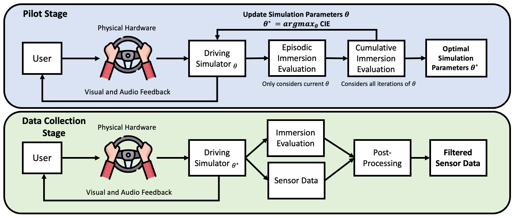

<!-- |Paper|Datasets|Code| -->
<!-- |:---|---|---| -->
<!-- |[**ICRA 2023 (TBD)**](https://arxiv.org)| [**GDrive (TBD)**](https://google.com)| [**Github (TBD)**](https://github.com)     |  -->

<!-- <p align="center"><iframe width="700" height="400" src="https://www.youtube.com/embed/u6CTwj3lc8I" frameborder="0" allow="accelerometer; autoplay; encrypted-media; gyroscope; picture-in-picture" allowfullscreen></iframe></p> -->

<!-- <b>Authors: </b> 
<a href="https://laurayuzheng.github.io/">Laura Zheng</a>, 
<a href="https://github.com/SonSang">Sanghyun Son</a>, 
<a href="https://www.cs.umd.edu/people/lin">Ming Lin</a> -->

<b>Abstract:</b> 
<div style="text-align: justify"> 
Virtual reality (VR) is a powerful yet underutilized tool for understanding human behavior in context of autonomous driving.
Often user studies are used in evaluation of the outputs of proposed methods or systems.  In contrast, in this work we examine the possibility of using study results 
conducted in a VR system for data generation to model human behaviors. Autonomous driving, at its core, involves 3D interaction with humans both as users and as actors in the environment. Today, there is little in autonomous driving research that explores human studies in VR as an avenue of data collection and behavioral understanding. 
In this paper, we combine systematic practices for VR user studies with knowledge of key problems from autonomous driving research to standardize and establish guidelines in VR-based user studies for autonomous driving.
</div>

<br>

<b>Additional Results and Supplementary Material</b> 
<div style="text-align: justify"> 
TBD

<!-- 
Average velocity of traffic flow over time for each of the 26 CARLA Leaderboard Test Scenarios.
We show the traffic flow of LBC (baseline) versus our method for each of the 26 Test Scenarios over 1000 timesteps. For most scenarios, with the exception of scenarios 8, 16, and 22, our method improves the local traffic flow by increasing average velocity.  -->

<br>


</div>


<!-- Please cite our work if you found it useful:

```
@unpublished{zhengsonlin_trafficdriving_2023,
  title={Traffic-Aware Autonomous Driving with Differentiable Traffic Simulation},
  author={Zheng, Laura and Son, Sanghyun and Lin, Ming C},
  year={2023}, 
  note={Under review at ICRA 2023}
}
``` -->